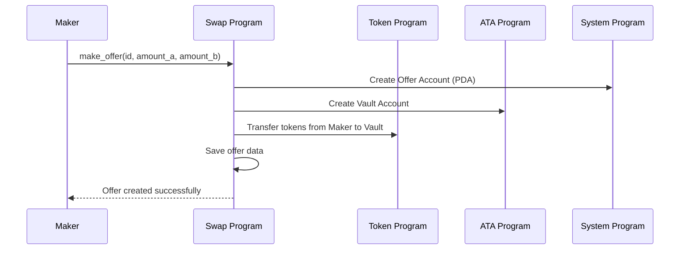
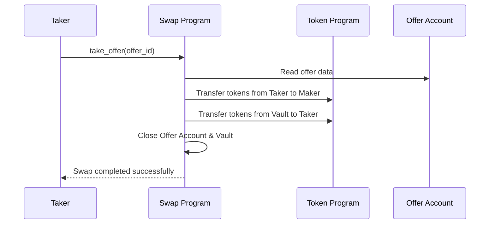

# 🌀 Solana Token Swap Program

A simple on-chain swap protocol on Solana built with the [Anchor framework](https://github.com/coral-xyz/anchor). This program allows two parties—a **maker** and a **taker**—to perform peer-to-peer token swaps with predefined amounts of two SPL tokens.

---

## ✨ Features

- Create token swap offers on-chain using PDAs
- Vault mechanism for securely escrowing maker's tokens
- Trustless token exchange between two users
- Automatic cleanup (closing accounts) after swap execution
- Written with Anchor for safety and developer ergonomics

---

## 📖 How It Works

### 🧑‍🎤 Maker Flow



### 🤝 Taker Flow



---

## 🛠️ Installation

```bash
# Clone the repo
git clone https://github.com/your-username/solana-token-swap.git
cd solana-token-swap

# Install dependencies
anchor install

# Build the program
anchor build

# Run tests (optional)
anchor test
```

---

## 🔧 Program Usage

### 1. **Make an Offer**

The maker initializes a swap offer and locks their tokens into a vault:

```ts
await program.methods
  .makeOffer(offerId, amountA, amountB)
  .accounts({
    maker: maker.publicKey,
    tokenMintA,
    tokenMintB,
    vaultAccount,
    offerAccount,
    ...
  })
  .signers([maker])
  .rpc();
```

### 2. **Take an Offer**

The taker accepts the terms and performs the swap:

```ts
await program.methods
  .takeOffer(offerId)
  .accounts({
    taker: taker.publicKey,
    offerAccount,
    vaultAccount,
    ...
  })
  .signers([taker])
  .rpc();
```

---

## 📂 Project Structure

```bash
├── programs/
│   └── swap/
│       └── src/lib.rs          # Anchor program logic
├── tests/
│   └── swap.ts                 # Mocha/Anchor tests
├── migrations/
│   └── deploy.ts               # Anchor deploy config
├── Anchor.toml                 # Anchor config file
└── README.md
```

---

## 🧪 Testing

Tests are written in TypeScript using the Anchor testing framework:

```bash
anchor test
```

Make sure you have a local validator running or use Solana Devnet.

---

## 🧱 Tech Stack

- [Solana](https://solana.com/)
- [Anchor](https://github.com/coral-xyz/anchor)
- [TypeScript](https://www.typescriptlang.org/)
- [Mocha](https://mochajs.org/) + [Chai](https://www.chaijs.com/) for testing

---

## 📄 License

This project is licensed under the MIT License.

---

## 🙌 Acknowledgements

- [Anchor Framework](https://github.com/coral-xyz/anchor)
- [Solana Labs](https://solana.com/)
- [Solana Cookbook](https://solanacookbook.com/)
- [SPL Token Docs](https://spl.solana.com/token)
