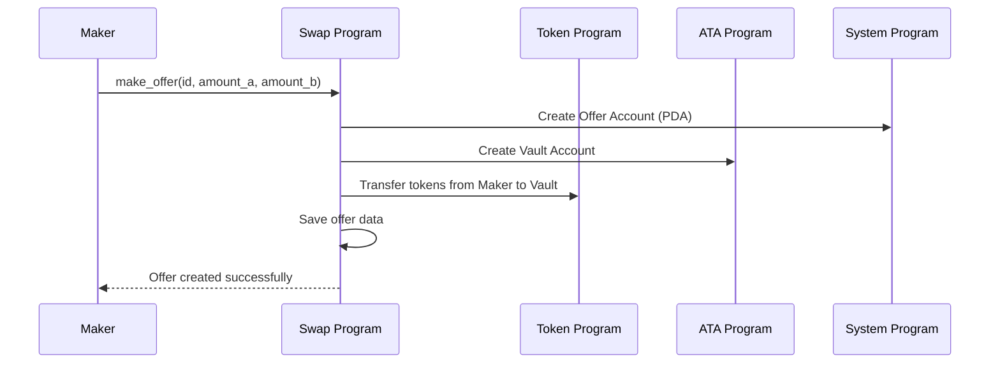

```mermaid
sequenceDiagram
    participant M as Maker
    participant SP as Swap Program
    participant TP as Token Program
    participant ATA as ATA Program
    participant SYS as System Program

    M->>SP: make_offer(id, amount_a, amount_b)
    SP->>SYS: Create Offer Account (PDA)
    SP->>ATA: Create Vault Account
    SP->>TP: Transfer tokens from Maker to Vault
    SP->>SP: Save offer data
    SP-->>M: Offer created successfully
```
