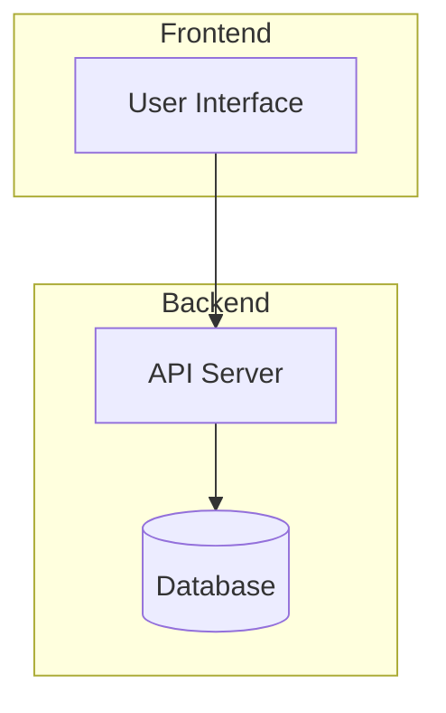
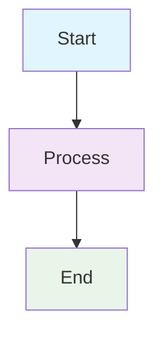

### **Code Block Syntax**

````markdown
# System Architecture


````

## Example: Creating Your Swap Program Diagram

Create a file called `swap-architecture.md`:

````markdown
# Solana Swap Program Architecture

This diagram shows how the swap program connects various components in Solana.

```mermaid
graph TB
    %% User Layer
    subgraph "User Layer"
        MAKER[👤 Maker User]
        TAKER[👤 Taker User]
        WALLET[💳 User Wallet]
    end

    %% Program Layer
    subgraph "Program Layer"
        SWAP_PROGRAM[🔧 Swap Program<br/>CPwhrNYciMycPAHJpakU2QFDuqt44V178fTPkTkGvmpz]

        subgraph "Instructions"
            MAKE_OFFER[📝 make_offer]
            TAKE_OFFER[📝 take_offer]
        end

        subgraph "State Accounts"
            OFFER_ACCOUNT[�� Offer Account<br/>PDA: [program_id, "offer", maker, id]]
        end
    end

    %% Token Layer
    subgraph "Token Layer"
        TOKEN_PROGRAM[🪙 Token Program]

        subgraph "Token Mints"
            MINT_A[🪙 Token Mint A]
            MINT_B[🪙 Token Mint B]
        end

        subgraph "Token Accounts"
            MAKER_TOKEN_A[💰 Maker Token A Account]
            VAULT[🏦 Vault Account]
        end
    end

    %% Connections
    MAKER -->|Signs| SWAP_PROGRAM
    SWAP_PROGRAM --> MAKE_OFFER
    MAKE_OFFER -->|Creates| OFFER_ACCOUNT
    TOKEN_PROGRAM --> MINT_A
    TOKEN_PROGRAM --> MAKER_TOKEN_A
    MAKER_TOKEN_A -->|Transfer| VAULT
```
````

## Where to View Mermaid Files

### **GitHub/GitLab**

- Automatically renders in markdown files
- Just commit and push - no setup needed

### **VS Code**

- Install "Markdown Preview Enhanced" extension
- Right-click → "Open Preview"

### **Local Development**

- Use Mermaid Live Editor for testing
- Use VS Code with extensions for development

### **Documentation Sites**

- **Docusaurus**: Built-in Mermaid support
- **VuePress**: With plugins
- **GitBook**: Native support

## Quick Start Template

Create `diagram.md`:

````markdown
# My Diagram


````

## Tips

1. **Use comments** (`%%`) to organize your diagrams
2. **Group related elements** with `subgraph`
3. **Use emojis** for visual appeal
4. **Test in Mermaid Live Editor** first
5. **Keep diagrams simple** - complex ones can be hard to read

The most common and recommended approach is **Method 1** - creating a markdown file with Mermaid code blocks, as it works everywhere and is easy to version control.
